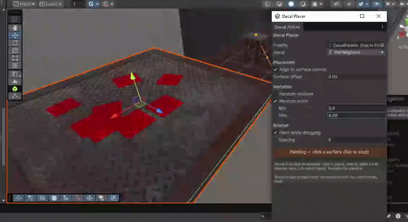
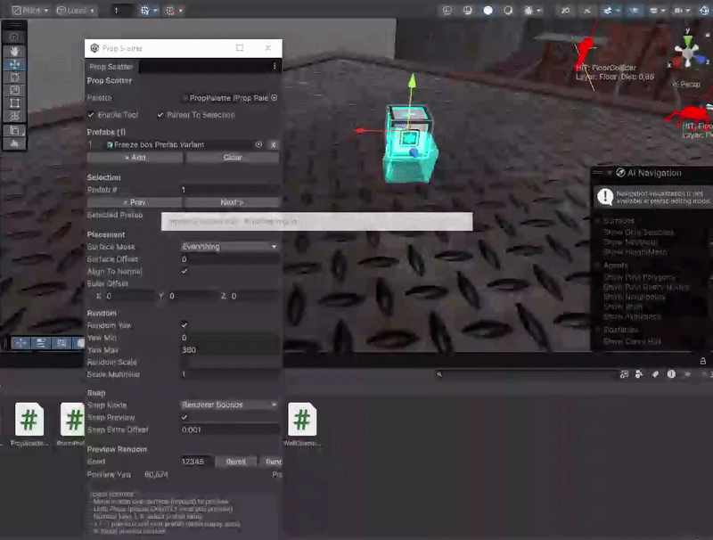
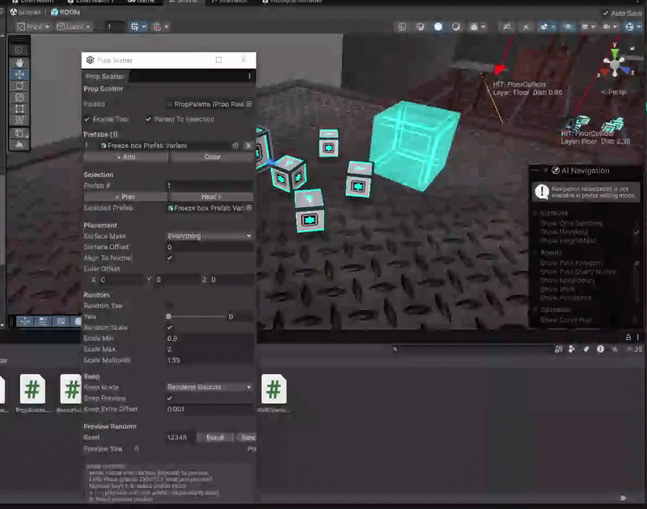

# FD Prop Scatter & Decal Projector

Two Unity Editor painting tools to make your life a bit easier when placing objects, using a custom palette of your choice.



## Includes:

- **Prop Scatter** — click anywhere in the scene to place a prop from your palette. Switch the active prop from the window or with keypad `0`–`9`.
- **Decal Projector** — same idea but for URP `DecalProjector` components. Includes a Y offset so the decal box goes deep enough to paint even uneven surfaces.

Both tools support optional random **yaw** and **scale**, and both let you click-and-drag to paint continuously. You can also choose whether the tool picks up **colliders** or **mesh** as the paint surface.

## Prop Scatter

Paint prefabs on any surface. Assign your `PropPalette`, pick a prop from the list (or keypad `0`–`9`), and click in the Scene view. Hold and drag to paint continuously.



## Decal Projector

Same flow, but places URP `DecalProjector` components from a `DecalPalette`. The Y offset pushes the projector's box into the surface so it always covers what you're aiming at, even on uneven geometry.



## Install

Package Manager → `+` → **Add package from git URL** →

```
https://github.com/FrancoDowho/FD-Prop-Scatter-Decal-Projector.git
```

Requires **URP** (declared as a dependency, so Package Manager installs it if you don't have it).

## Usage

1. Create a palette: `Tools → FD Painters → Create Prop Palette` (or `Create Decal Palette`). A save dialog opens — pick where to save it in your project.
2. Fill the palette in the Inspector — drag prefabs into the prop palette, or add material entries to the decal palette.
3. Open the tool: `Tools → FD Painters → Prop Scatter` (or `Decal Projector`).
4. Assign your palette in the window, enable painting, and click in the Scene view.

### Controls (both tools)

- **Left click** in Scene view → place at cursor
- **Left click and drag** → paint continuously
- **Keypad 0–9** → switch active palette slot

## Requirements

- Unity 2022.3 LTS or newer
- URP (Universal Render Pipeline) — the Decal Projector tool uses `UnityEngine.Rendering.Universal.DecalProjector`

## License

MIT — see [LICENSE.md](LICENSE.md).
